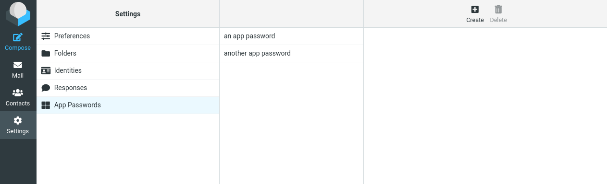

# Stalwart App Passwords for Roundcube

Manage [Stalwart Mail Server](https://stalw.art/) application passwords directly from Roundcube webmail.




## What's This About?

If you're running Stalwart Mail Server with OIDC authentication (Authentik, Keycloak, etc.), you may have noticed a small problem: your users can't access Stalwart's built-in management portal. That portal requires local Stalwart accounts, which OIDC users don't have.

This becomes an issue when users need app passwords for email clients like Thunderbird, iOS Mail, or Outlook. While some clients support OAuth2, many users just want a simple password they can copy-paste and be done with.

This plugin adds an "App Passwords" tab to Roundcube's settings, letting users create and manage app passwords without leaving webmail. It authenticates using the same OAuth token they already have from logging in - no extra configuration needed on the user side.

## Features

- Create app passwords for email clients (Thunderbird, iOS Mail, Outlook, etc.)
- List existing app passwords with creation dates
- Delete app passwords
- Seamless integration with Roundcube's Settings UI
- Works with OAuth/OIDC authentication
- Native look on Elastic skin, functional fallback on other skins

## Requirements

- Roundcube 1.6 or later
- Stalwart Mail Server with Management API enabled
- OAuth/OIDC authentication configured (plugin uses the OAuth token to authenticate with Stalwart)
- PHP 7.4 or later with curl extension

## Installation

1. Download or clone this repository to your Roundcube plugins directory:
   ```bash
   cd /path/to/roundcube/plugins
   git clone https://github.com/yourusername/stalwart_apppasswords.git
   ```

2. Copy the configuration file:
   ```bash
   cd stalwart_apppasswords
   cp config.inc.php.dist config.inc.php
   ```

3. Edit `config.inc.php` with your Stalwart API URL:
   ```php
   $config['stalwart_api_url'] = 'http://stalwart:8080/api';
   ```

4. Enable the plugin in your Roundcube configuration (`config/config.inc.php`):
   ```php
   $config['plugins'] = array(
       // ... other plugins ...
       'stalwart_apppasswords',
   );
   ```

## How It Works

This plugin uses Stalwart's `/api/account/auth` endpoint to manage app passwords. It authenticates using the OAuth access token from the user's Roundcube session, which means:

1. Users must be logged in via OAuth/OIDC (e.g., Authentik, Keycloak)
2. Stalwart must be configured to validate tokens from the same identity provider
3. No additional credentials are needed

## Stalwart Configuration

Ensure Stalwart is configured to accept OAuth tokens from your identity provider:

```toml
[directory."authentik"]
type = "oidc"
endpoint.url = "https://your-idp.example.com/application/o/userinfo/"
endpoint.method = "userinfo"
fields.email = "email"
fields.username = "preferred_username"
```

## Troubleshooting

### "Authentication error" message

- Ensure you're logged in via OAuth/OIDC (not with a local password)
- Check that Stalwart trusts your identity provider's tokens

### "Could not connect to mail server"

- Verify `stalwart_api_url` is correct and accessible from Roundcube server
- Check firewall rules between Roundcube and Stalwart

### Plugin doesn't appear in Settings

- Ensure the plugin is listed in `$config['plugins']`
- Check Roundcube error logs for PHP errors